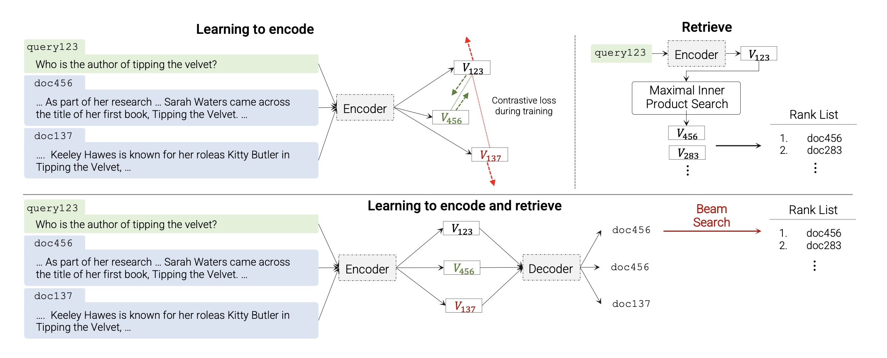

</img>

# Spectral

Spectral is an information retrieval system using attention as a paradigm for end-to-end search.

Spectral's transformer-based architecture exhibits stronger and continual scaling laws that improve over present state-of-the-art, contrastive learning dual encoders, that plateau at fewer parameters.

Mistral's 8x7B LLM is selected as a pretrained, mixture-of-experts generative model. Indexing and retrieval is learned through fine-tuning on semantically structured identifiers and tokenized documents. New corpora is "memorized" at inference time with long-range attention through a key-value, non-differentiable store, removing the need for finetuning and weight updates.

## Citations

```bibtex
@inproceedings{Vaswani2017AttentionIA,
  title   = {Attention is All you Need},
  author  = {Ashish Vaswani and Noam M. Shazeer and Niki Parmar and Jakob Uszkoreit and Llion Jones and Aidan N. Gomez and Lukasz Kaiser and Illia Polosukhin},
  journal = {Neural Information Processing Systems},
  year    = {2017}
}
```

```bibtex
@misc{tay2022transformer,
  title   = {Transformer Memory as a Differentiable Search Index},
  author  = {Yi Tay and Vinh Q. Tran and Mostafa Dehghani and Jianmo Ni and Dara Bahri and Harsh Mehta and Zhen Qin and Kai Hui and Zhe Zhao and Jai Gupta and Tal Schuster and William W. Cohen and Donald Metzler},
  journal = {arXiv preprint arXiv:2202.06991},
  year    = {2022}
}
```

```bibtex
@article{wu2022memorizing,
  title   = {Memorizing transformers},
  author  = {Wu, Yuhuai and Rabe, Markus N and Hutchins, DeLesley and Szegedy, Christian},
  journal = {arXiv preprint arXiv:2203.08913},
  year    = {2022}
}
```

```bibtex
@article{Shazeer2019FastTD,
  title   = {Fast Transformer Decoding: One Write-Head is All You Need},
  author  = {Noam M. Shazeer},
  journal = {ArXiv},
  year    = {2019},
  volume  = {abs/1911.02150}
}
```

```bibtex
@Article{AlphaFold2021,
  author  = {Jumper, John and Evans, Richard and Pritzel, Alexander and Green, Tim and Figurnov, Michael and Ronneberger, Olaf and Tunyasuvunakool, Kathryn and Bates, Russ and {\v{Z}}{\'\i}dek, Augustin and Potapenko, Anna and Bridgland, Alex and Meyer, Clemens and Kohl, Simon A A and Ballard, Andrew J and Cowie, Andrew and Romera-Paredes, Bernardino and Nikolov, Stanislav and Jain, Rishub and Adler, Jonas and Back, Trevor and Petersen, Stig and Reiman, David and Clancy, Ellen and Zielinski, Michal and Steinegger, Martin and Pacholska, Michalina and Berghammer, Tamas and Bodenstein, Sebastian and Silver, David and Vinyals, Oriol and Senior, Andrew W and Kavukcuoglu, Koray and Kohli, Pushmeet and Hassabis, Demis},
  journal = {Nature},
  title   = {Highly accurate protein structure prediction with {AlphaFold}},
  year    = {2021},
  doi     = {10.1038/s41586-021-03819-2},
  note    = {(Accelerated article preview)},
}
```

```bibtex
@inproceedings{Rae2020DoTN,
  title   = {Do Transformers Need Deep Long-Range Memory?},
  author  = {Jack W. Rae and Ali Razavi},
  booktitle = {ACL},
  year    = {2020}
}
```

```bibtex
@misc{ding2021erniedoc,
  title   = {ERNIE-Doc: A Retrospective Long-Document Modeling Transformer},
  author  = {Siyu Ding and Junyuan Shang and Shuohuan Wang and Yu Sun and Hao Tian and Hua Wu and Haifeng Wang},
  year    = {2021},
  eprint  = {2012.15688},
  archivePrefix = {arXiv},
  primaryClass = {cs.CL}
}
```

```bibtex
@misc{henry2020querykey,
    title   = {Query-Key Normalization for Transformers},
    author  = {Alex Henry and Prudhvi Raj Dachapally and Shubham Pawar and Yuxuan Chen},
    year    = {2020},
    eprint  = {2010.04245},
    archivePrefix = {arXiv},
    primaryClass = {cs.CL}
}
```